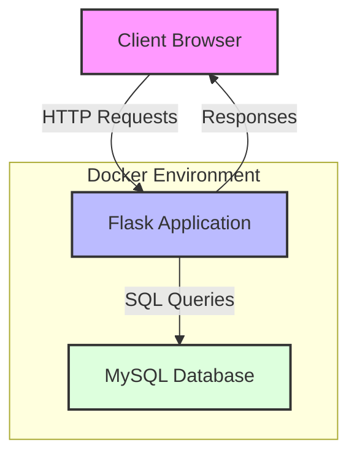
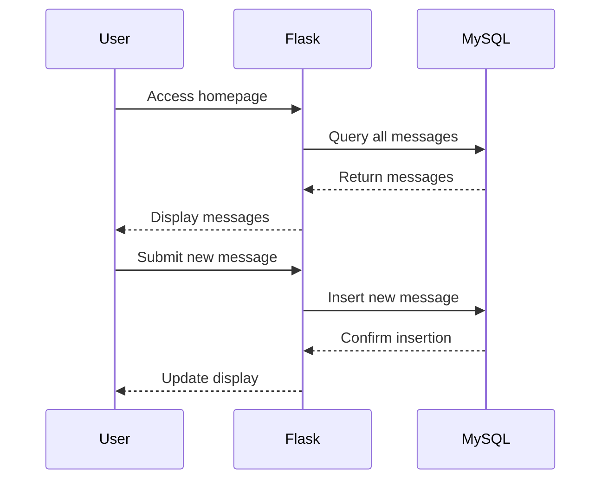
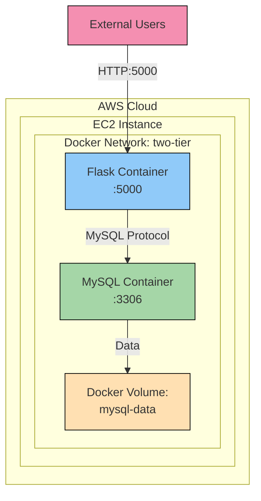

# two-tier-flask-app

A fully automated CI/CD pipeline that deploys a two-tier Flask application on AWS EC2 using Docker, Jenkins, and Docker Compose. It connects with GitHub for version control and delivers smooth, hands-free deployments.

## Project Overview

This application demonstrates a modern containerized web application architecture with:
- A Flask web application serving as the frontend and API layer
- A MySQL database for persistent data storage
- Docker containers for consistent deployment
- Jenkins pipeline for automated CI/CD
- AWS EC2 for cloud hosting

> **Note**: The AWS EC2 instance used for demonstration purposes is currently down. The application can still be run locally using Docker Compose as described in the Getting Started section.

## Architecture

The application implements a two-tier architecture pattern:



### Application Flow



## CI/CD Pipeline Flow

```mermaid
graph LR
    A[GitHub Repository] -->|Webhook| B[Jenkins]
    B -->|Pull| C[Build Docker Images]
    C -->|Push| D[Deploy to EC2]
    D -->|Start| E[Docker Compose Up]
    E -->|Health Check| F[Application Ready]
    style A fill:#f9f,stroke:#333,stroke-width:2px
    style B fill:#bbf,stroke:#333,stroke-width:2px
    style C fill:#dfd,stroke:#333,stroke-width:2px
    style D fill:#fdf,stroke:#333,stroke-width:2px
    style E fill:#dff,stroke:#333,stroke-width:2px
    style F fill:#ffd,stroke:#333,stroke-width:2px
```



## Technical Stack

- **Frontend**: HTML templates served by Flask
- **Backend**: Python Flask application
- **Database**: MySQL
- **Containerization**: Docker and Docker Compose
- **CI/CD**: Jenkins pipeline
- **Cloud Platform**: AWS EC2
- **Version Control**: GitHub

## Components

### Flask Application (`app.py`)
- Serves the web interface
- Handles message submissions
- Manages database connections
- Implements RESTful endpoints

### Database
- MySQL instance
- Stores messages table
- Persists data using Docker volumes

## Docker Configuration

The application uses Docker Compose to manage two services:

1. **MySQL Service**:
   - Uses official MySQL image
   - Persists data using Docker volumes
   - Configured with health checks
   - Exposed on port 3306

2. **Flask Service**:
   - Custom-built using Dockerfile
   - Depends on MySQL service
   - Exposed on port 5000
   - Includes health monitoring

## Deployment Architecture



## Getting Started

1. Clone the repository:
   ```bash
   git clone https://github.com/agrimasharma031/two-tier-flask-app.git
   cd two-tier-flask-app
   ```

2. Start the application locally using Docker Compose:
   ```bash
   docker-compose up -d
   ```

3. Access the application:
   - Open your browser and navigate to `http://localhost:5000`

## Environment Variables

The application is configurable through environment variables:

- `MYSQL_HOST`: Database host address
- `MYSQL_USER`: Database user
- `MYSQL_PASSWORD`: Database password
- `MYSQL_DB`: Database name

## Jenkins Pipeline

The included Jenkinsfile defines the CI/CD pipeline that:
1. Pulls the latest code from GitHub
2. Builds Docker images
3. Runs tests
4. Deploys to AWS EC2
5. Performs health checks
6. Ensures zero-downtime deployment

## License

This project is licensed under the MIT License - see the LICENSE file for details.
